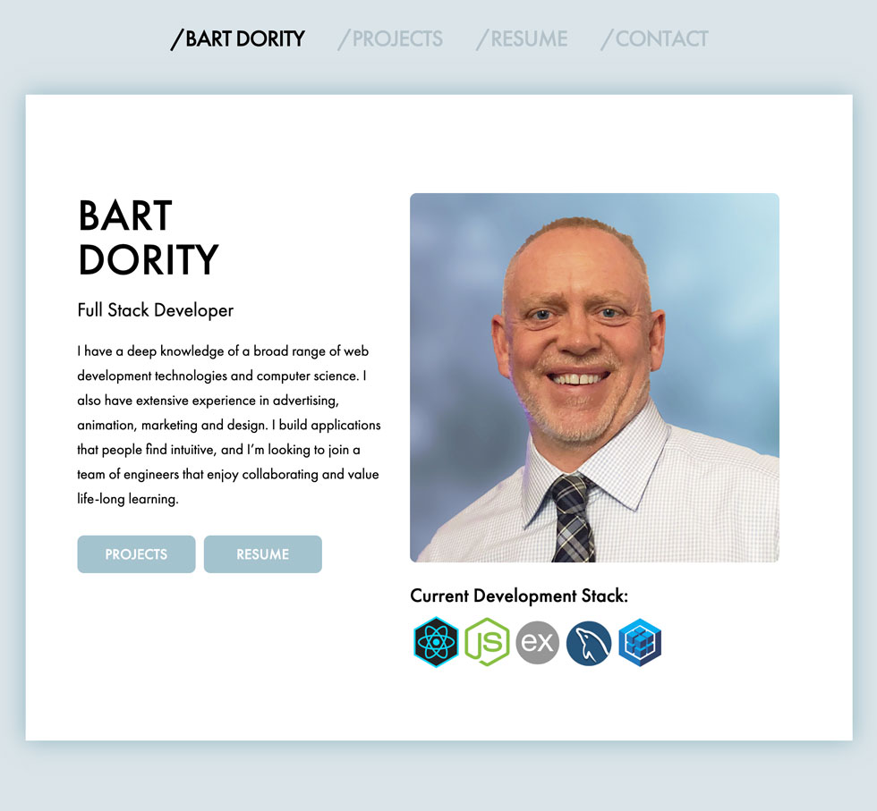

# Bart Dority - Full Stack Developer Portfolio
This is a react app that uses JSON data to showcase my lastest projects.


# Table of contents
1. [Installation](#Installation)
2. [Usage](#Usage)
3. [Live Demo](#Live_Demo)
4. [License](#License)
5. [Features](#Features)
6. [Technology](#Technology)
7. [Credits](#Credits)
8. [User Story](#User_Story)
<a name="Installation"></a>
## Installation
```sh
npm install
```
<a name="Usage"></a>
## Usage
```sh
npm start
```
<a name="Live_Demo"></a>
## Live Demo
<a href="http://vast-coast-19153.herokuapp.com">Live Demo on Heroku</a>
<a name='License'></a>
## License
[](https://lbesson.mit-license.org/)
<a name="Features"></a>
## Features
1. mobile friendly layout
2. interactive project cards
3. contact form
4. css based animations

<a name="Technology"></a>
## Technology
1. React
2. Express
3. NodeJS
4. JSON


<a name="User_Story"></a>
## User Story
```sh
As recruiter or fellow engineer I want to be able to quickly see all of Bart's relevant project work, and the technologies that were used to create them.

As a job-seeker, I want to be able to showcase my latest and best work and the technologies that were used to build these projects.
```


<a name="Credits"></a>
## Credits
Bart Dority


**on github:** <a href='github.com/b0rgBart3'>b0rgBart3</a>

[](https://github.com/remarkablemark)

Email: borgBart3@gmail.com

